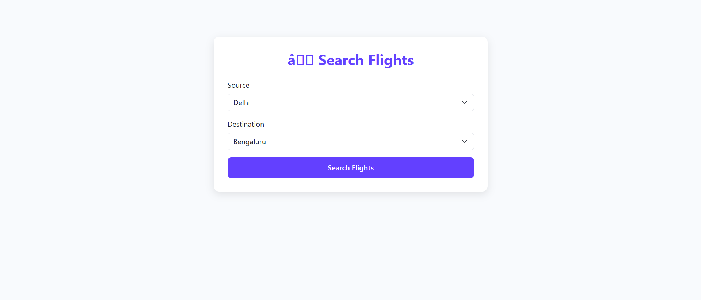
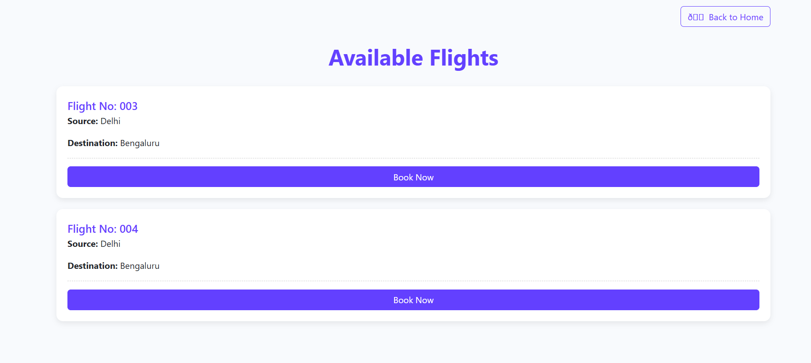
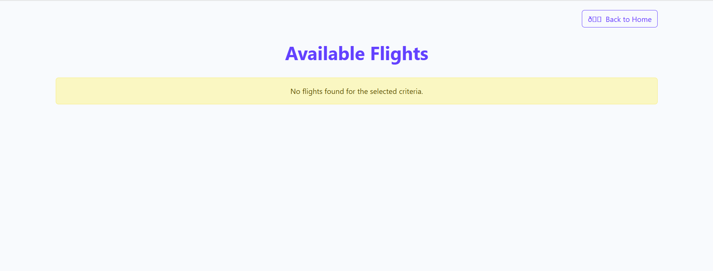

# ✈️ SeeFlights

SeeFlights is a simple **Flight Search Web Application** built using **Spring Boot** and **JSP**.  
Users can search for flights by selecting a **Source** and **Destination**, and the application displays a list of available flights along with their details.  

---

## 🚀 Features
- Search flights by **Source** and **Destination**.
- Displays **Flight Number, Source, and Destination** in a clean UI.
- Responsive design using **Bootstrap & CSS**.
- Data stored in a simple **Java List** (no database required).
- Option to navigate back to the **Home Page**.

---

## Screenshots

### Search Flights Page
Here, users can select the source and destination to search flights.  



---

### Available Flights Page
After submitting, all flights matching the criteria will be displayed.  



---
After submitting, if flight are not available then this Pafe will open.  



---

## Tech Stack
- **Java (Spring Boot)** – Backend Framework
- **JSP** – Frontend Views
- **Bootstrap 5** – Styling
- **HTML & CSS** – UI Design
- **List (Java Collections)** – Data storage

---

## How It Works
1. User selects **Source** and **Destination** from dropdowns.
2. Clicks **Search Flights** button.
3. A new page displays all matching flights from the **Java List**.
4. Each result shows **Flight No, Source, Destination**, with a **Book Now** button.

---

## ▶️ Getting Started

### Prerequisites
- Java 17+
- Maven
- Spring Boot
- IDE (IntelliJ / Eclipse / STS)

### Steps to Run
1. Clone the repository:
   ```bash
   git clone https://github.com/your-username/SeeFlights.git
   ```
2. Open the project in your IDE.
3. Run the Spring Boot Application:
   ```bash
   mvn spring-boot:run
   ```
4. Open browser and go to:
   ```
   http://localhost:8080
   ```

---

## 📌 Future Enhancements
- Add user authentication and booking functionality.
- Store flights in a **database (MySQL/PostgreSQL)**.
- Add flight price, duration, and airline details.
- Improve UI with more animations and filters.

---

## 👨‍💻 Author
Developed by **[Priydev Mishra]** 🚀  
